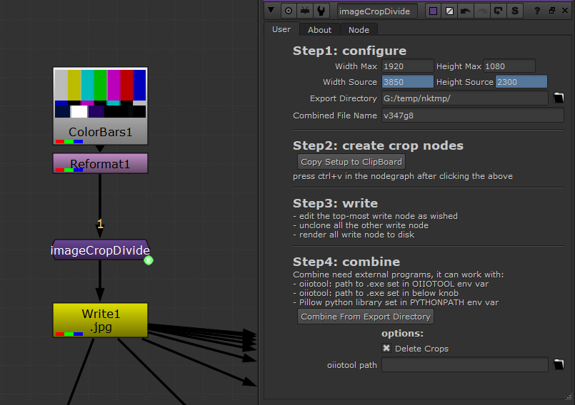

# imageCropDivide

Divide an image into multiple crops so it can be recombined later. This has some
usefulness in the context of some nuke versions ...

# requires

- Nuke or Nuke Non-Commercial
- Nuke with Python >= 2.7
- All OS should be supported but was only tested on Windows.

The combine feature requires `oiiotool` or `Pillow` to be availble on the
system. See below for more information.

# Usage

- Copy/paste the content of [ImageCropDivide.nk](ImageCropDivide.nk) in Nuke.

- Set the desired max dimensions and your source size if the defaults are not expected.
- `Export Directory`: Set where the directory where the crops must be exported
- `Combined File Name`: if you use the combine feature, name without the extension, of the combined file.
- Click the `Copy ...` button
- press ctrl+v to paste the node setup in the nodegraph.
- connect the top write node to the same node as the imageCropDivide node
- On any of the cloned Write node, modify the settings for export as desired.
- Unclone all the Write nodes `(Alt + shift + K)`
- Render all the Write nodes
- Once finished you have the option to combine the exported crops. See below
for details.

> [!WARNING] 
> it seems that changing the file type of cloned write node make nuke crash
> so you might have to unclone first and propagate changes on all write nodes :/

# combining

Combining will find ALL images in the `Export Directory` and combine them to
a single image named using `Combined File Name` knob value.

> [!WARNING] 
> make sure the `Export Directory` doesn't contain anything else than
> the crop you just exported before combining.

Combining require external softwares. Different options are available and
automatically detected.

Here are the option in their order of priority :

## oiiotool

Recommended option. Use the `oiiotool.exe` CLI from OpenImageIO to combine back the crops.

You can specify the path to the oiiotool executable in 2 ways :
- environment variable `OIIOTOOL`
- the `oiiotool path` knob on the node

> [!TIP]
> You can find it in the Arnold render-engine installation like 
> `C:\Program Files\Autodesk\Arnold\maya{VERSION}\bin`

## Pillow

A python library for image processing. It work for simple case but suck 
for anything else (anything not 8bit).

It simply requires Pillow to be importable in the python context (`from PIL import Image`).

# faq

> Why is there a ModifyMetadata node ?

This is the only way I found for now to have a different suffix per Write 
node and have them cloned at start. I could remove them and set directly the 
suffix on each unique Write node but then it would be a pain to modify one setting
on all the write nodes.

# Developer

Instructions to develop the node.

[ImageCropDivide.nk](ImageCropDivide.nk) is the result of a build process defined
in [src/](src).

It consist of combining nk file templates (because they have variables) with
python scripts to form a single `.nk` node.

To build the node simply execute [build.py](src/build.py) from any python 3
interpreter.

File suffixed with `-template` contained variable replaced during build.
Variables have the syntax `%VARIABLE_NAME%`.

# Licensing 

**Apache License, Version 2.0** (OpenSource)

See [LICENSE.md](./LICENSE.md).

Here is a quick resume :

- ✅ The licensed material and derivatives may be used for commercial purposes.
- ✅ The licensed material may be distributed.
- ✅ The licensed material may be modified.
- ✅ The licensed material may be used and modified in private.
- ✅ This license provides an express grant of patent rights from contributors.
- 📏 A copy of the license and copyright notice must be included with the licensed material.
- 📏 Changes made to the licensed material must be documented
