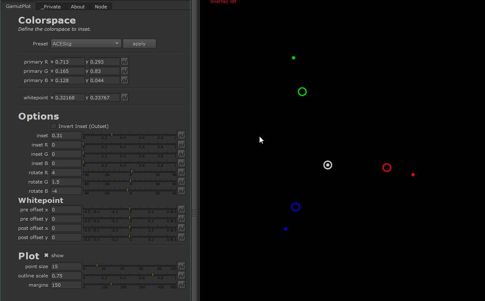

# Primaries Inset

Create a reshaped version of a colorspace's gamut and apply it on images using
a 3x3 matrix. It is possible to visuallize the gamut transformation in a 
CIE xy graph plot.

The reshape transformation is called an "inset" as we are creating a smaller
gamut than the original (but note we actually apply the inverse conversion making
the source gamut smaller than the new gamut).

This is the main concept behind [the AgX DRT](https://github.com/sobotka/AgX) ([ personal fork](https://github.com/MrLixm/AgXc)) which
was also [ported to darktable](https://github.com/darktable-org/darktable/pull/15104).

| enabled                                                                  | disabled                                                                    |
|--------------------------------------------------------------------------|-----------------------------------------------------------------------------|
|  |  |

> The above example is in the context of a traditional ACES workflow (note the
ACES view-transform in the viewer) but could be used with any other "tonemapping".

The PrimaryInset operation works bests with the application of a 1D tonescale curve
(usually reffered as tonemapping) after itself thanks to the increase of complimentary
in the RGB values, which help achieve crosstalk during per-channel (produced by the tonescale).

# Instructions

## Install

- Copy/paste the content of [PrimariesInset.nk](PrimariesInset.nk) in any nuke
scene.
- That's it

## Requirements

The tool use the following features :

- python code for `Presets` but works on non-commercial versions.
  - The python code _should_ be python 2 compatible but has only been tested on latest
python3 versions of Nuke.
- blink script but works on non-commercial versions >= 14.0

## Basic-Usage

- Expect an image to be transformed as input.
- Select the preset corresponding to the input image's colorspace encoding.
- Click the apply button: the _primary X_ and _whitepoint_ knobs are updated.
- In the _Option_ section, start playing with the global inset.
- To see exactly how it affect the original colorspace you can click on `show` 
in the _Plot_ section : your image disapear to leave a dark squared canvas with
only a gamut visible.
- Keep playing with the _Options_ to see how it works.

### default values

Here is some default values that are recommended when using `BT.2020` as source
gamut. They are based on the [darktable implementation](https://github.com/darktable-org/darktable/pull/15104)
and Troy Sobotka work.

- inset: `0.15 - 0.25`
- inset R: `0.06` : additional decrease of purity for red that can be still quite srong
- inset B: `0.15` : additional decrease of purity for blue that tend to look deeper
- rotate R: `5` : shift reds in favor of yellowness which work better for fire and sunsets.
- rotate B: `-6` : sift blues to compensate for Abney effect

## Outset-workflow

If you find the effect of the inset too strong you can apply an outset after the
tonescale has been applied to restore purity but preserve the "whiteness" in highlights:

Unfortunately the workflow is complicated because you need to apply the tonescale
before applying the outset. And the tonescale is usually part of the output-transform.

In the case of an ACES workflow :

1. apply `PrimaryInset` node as usual
2. apply ACES view-transform (OCIO Display node)
3. revert the sRGB EOTF conversion to get back ACEScg value
4. duplicate the first `PrimaryInset` node from step 1. but check the `Invert` option
5. reapply the sRGB EOTF conversion for display.
6. make sure the viewer view-transform is set to raw or similar.

## Plotting

It is possible to preview the new inset colorspace as a plot in the CIE1931 xy space
(note this is not a perceptual space).

Just check the `show` checkbox next to the `Plot` title.

While plotting you can check `Invert Inset` to see the actual destination colorspace
being used for the math conversion (kind of unintuitive yes).

# Developer

See the [./src/](./src) folder for development instructions.

## TODO

- [ ] fix NO_HANDLE flag that is not preserved between sessions (woudl require `onCreate` callback)
- [ ] add grid to plot
- [ ] draw gamuts boundaries with lines
